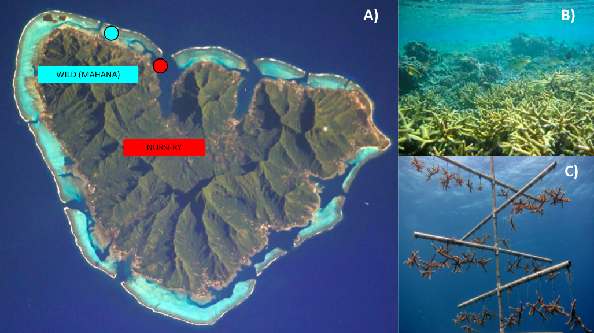

# Introduction

|       Coral reefs are among the most biodiverse ecosystems in the world. Accounting for less than 0.1% of the global surface area they are home to more than 30% of all marine species (Reaka-Kudla 2005). In addition to the high levels of biodiversity that coral reefs support, coral reefs support 500 million people globally (Global Coral Reef Monitoring Network 2004) through fisheries, and ecotourism businesses. Because coral reefs support so many people, they are considered billion dollar commodities. In the US alone, coral rees provide an economic value of 3.4 billion dollars a year (NOAA 2013). However, in the last 50 years coral reefs have faced a global decline from myriad of local and global anthropogenic impacts such as declining water quality, overfishing, rising sea surface temperatures and ocean acidification. To date reefs have seen a reduction of 30-50% in live coral cover globally with major spikes in decline after major bleaching events(Selig, Casey, and Bruno 2012; Gardner et al. 2003). 
  

|       The global decline of live coral cover over the last couple of decades has created the need for active, coordinated, effective, and quick human interventions (Rinkevich, 1995; Young, Schopmeyer, & Lirman, 2012; van Oppen et al., 2017; Lohr et al., 2020). To date there are over 300 active coral restoration projects globally which are spread across 56 countries and collectively target 229 species from 72 coral genera (Boström-Einarsson et al. 2020). Of these 300+ active restoration projects, nearly half utilize coral's ability to asexually reproduce through fragmentation, in a process called coral gardening. Coral gardening is a three step process in which fragments from healthy wild colonies are taken, grown in an in-situ nursery (Figure 1B), and are outplanted to degraded reef sites. 
  

|       While coral restoration practices such as coral gardening have been successful at increasing biomass and coral cover at degraded reef sites, most metrics for success revolve around growth and adult survival. However these metrics fail to assess key aspects of the coral's response to the coral gardening process, such as reproductive fitness in these nursery reared and outplanted corals. Given the current state of coral reefs globally, there is a strong need to understand how restored corals are impacted at a reproductive level throughout the coral gardening process in order to properly understand how these corals may repopulate future sites.
  

|       To date reproductive potentials of nursery-reared and outplanted corals have been widely understudied but are vital metrics to the longevity of restored populations. In this experiment, the reproductive capacities of nursery reared and wild *Acropora pulchra* colonies were compared. Nursery colonies were reared on vertical, mid-water column, nursery trees located in the backreef on the north shore of Mo’orea, French Polynesia, while wild colonies were collected from one backreef sites along the north shore (Figure 1). All corals spawned successfully in October of 2019 and 2020 were used to to quantify fecundity, eggs per bundle, egg size, egg ratio, and fertilization rates. Colony crosses were conducted by site (nursery vs wild) and reared at two temperature treatments, 28°C (ambient) and 31°C (heat stress) and fixed three hours post to obtain fertilization rates. 

# Methods

|       Of the many species targeted for restoration purposes *Acropora spp.* account for approximately 30% of species used in current conservation plans (Boström-Einarsson et al. 2020) because of their high growth rates, natural use of fragmentation for asexual reproduction, and ability to rapidly heal wounds (Gladfelter et al. 1978; Tunnicliffe 1981; Bak and Criens 1982; Highsmith 1982; D. Lirman et al. 2010). We chose *Acropora pulchra* in particular study because it has been successfully spawned and crossed in a laboratory setting and is commonly found in the back reef lagoon environment in Mo’orea in large thickets that provide essential habitat for other corals, reef invertebrates, and reef fishes.
  
|       Donor corals for this experiment were tagged in the field, clipped and grown out in the coral nurseries, which are vertical, mid-water nursery trees at the edge of the boat channel in the back reef of Oponohou Bay on the island of Moorea, French Polynesia (Figure. 1). For both 2019 and 2020 spawning data, colonies from the nursery and wild sites were checked for bundles (snapping a piece off and seeing if there are pink bundles present), collected, and brought back to the lab at the first full moon in October because spawning occurs one week after the full moon in October for this species. These corals were held in flow through tanks during the days and  were monitored each night for ten days. Each night at 20:00, the corals were checked to see if they were setting (engorged polyps), the ones that were setting, which meant they would release bundles, were isolated in static chambers. Bundles were released around 21:00 each night and once they started releasing the following metrics were taken immediately, fecundity and eggs per bundle. Egg Size and Egg ratio

### *Fecundity*

|       At the time of setting 20:00-21:00, colonies were identified as those that would spawn or not. A branch of set polyps was clipped from each colony and stored in 50mL falcon tubes filled with 0.2 micron filtered seawater (FSW). These isolated branches were left on the benchtop to release bundles throughout the evening. At the end of spawning, these bundles are collected using pipettes and transferred into 15mL Falcon tubes. Every bundle released was collected and transferred to the new 15mL tube. These bundles were concentrated with as little FSW as possible and fixed with 5mL of 10% formalin. During the fixation process the bundles break apart and the eggs were preserved. These eggs were photographed under a dissecting microscope and the resulting photos were counted to get total number of eggs per colony each evening that it released. These counts were then normalized to surface area by the wax dipping method (Veal et al. 2010). 

  
|    ***2019***: Fecundity was taken fully for n = 7 colonies. Total nursery colonies were n = 6 
|    (Apul_7C1, Apul_8C6, Apul_12C1, Apul_14C5, Apul_7, Apul_15C2). Total wild colonies were n = 1 
|    (Apul_6).

|    ***2020*** : Fecundity measurements fully taken for n = 23 colonies. Total nursery colonies were n=4 
|    ( Apul_1, Apul_4, Apul_9, and Apul_14_4.2). Total wild colonies were n = 7 (Apul_202, 203, 75, 80, 
|    201, 76, and 206). Certain colonies spawned multiple evenings.

  
### *Eggs per Bundle*

|       Once colonies started releasing, 24 replicate bundles from each spawned coral colony were collected and placed in a colony specific 24 well plate so that each colony had 24 bundles (one in each well, one plate per colony). These bundles were left on the bench top to disintegrate over time later they were inspected under a dissecting microscope and the number of eggs in each bundle was counted. These counts were averaged by colony and night of spawning. 

  
|    ***2019***: Eggs per bundle was taken for a total of n = 6 wild colonies (Apul_A, B, C, D, E, and 6), and 
|    n = 8 nursery colonies (Apul_6C5, 7, 7C1, 8, 8C6, 10,12C1, and 14C5)

|    ***2020***: Eggs per bundle was taken for a total of n = 11* wild colonies (Apul_75, 77, 80, 87, 201, 202, 203, 
|    204, 208, 76, and 206) and n = 4 nursery colonies (Apul_1, 4, 9, and 14_4.2).
  
  
### *Egg Size and Egg Ratio*

|       When spawning was observed, as many bundles as possible were collected from each colony. These bundles were transferred into 50mL falcon tubes for the time being, in as little water as possible (the bundles are positively buoyant so excess water was removed using a pipette). Once the 50mL Falcon tube was mostly full it was labeled and shaken. The shaking would break up the bundles to release the sperm and eggs. Once most of the bundles were broken (tube will look very opaque), it was poured through a 50 micron mesh cup over a bowl. This mesh would catch the eggs and the sperm would pour straight through. The sperm was put into a newly labeled 50mL falcon tube and set aside for fertilization crosses. The eggs were rinsed five times with 0.2 micron FSW. 0.25mL of eggs was pipetted into a 1.5mL microcentrifuge tube and fixed with 1mL of 10% formalin. These eggs were photographed under a dissecting microscope with a centimeter ruler for scale. In ImageJ, the longest diameter and the diameter directly perpendicular to that were measured. These diameters were used as a proxy for egg size and the ratio between the longest and perpendicular were used to calculate the egg ratio or the roundness of the egg.

|   ***2019***: Egg size was taken for a total of n = 6 wild colonies (Apul_A, B, C, D, E, and 6), 
|   and n = 6 nursery colonies (Apul_6C5, 7, 7C1, 10,12C1, and 14C5)

|   ***2020***: Egg size was taken for a total of n = 11  wild colonies (Apul_75, 76, 77, 80, 87, 
|   201, 202, 203, 204, 206 and 208), and n = 2 nursery colonies (Apul_1 and Apul_14_4.2)

### *Fertilization Rates*

|       The left over sperm and egg from egg size and ratio was set aside for potential crosses. The sperm was measured for concentration using a spectrophotometer. The ideal concentration is 1 * 10^7 sperm per mL. The absorbance value of the sperm at 750nm will give you the concentration using an equation. If the sperm concentration is over 1 * 10^7 sperm per mL value then crosses can be done provided that at least one other colony from that site produced concentrated enough sperm. 75uL of sperm and 150uL of egg from a given cross were put into a 1mL vial in tray that was filled with 1mL of FSW which rested in a water bath that represented the heat treatment for fertilization success. There was an ambient water bath that was heated to 28C and a heat treatment bath heated to 31C. The amount of vials filled and duplicated for the cross were duplicated in each heat bath treatment. The number of replicates of each cross ranged from 5-10 depending on the amount of gametes present. 

|   ***2019***: A total of 8 crosses were conducted in 2019. All of these crosses were nursery colonies. 
|   The majority of the crosses came from colonies C7, C8, C14 which were crossed on 20191021  and the 
|   remaining colonies (C12 and C14) were crossed on 20191024. All crosses were reared   both in Ambient 
|   (27C) and Heat (31C) treatments.

|   ***2020***: A total of 3 crosses were conducted in 2020. All the wild colonies (n=7 colonies) that spawned 
|   on 20201007 were pooled for sperm and egg, crossed and reared in both Ambient (27C) and Heat (31C) 
|   treatments. The two nursery colonies Apul_1 and Apul_14 were crossed as individual colonies 
|   (egg and sperm from each used to cross between colonies) and reared in both Ambient and Heat treatments.

# Figures

Figure 1. **A)** Map of Mo'orea, French Polynesia with Mahana or the Wild site (blue dot), and the Nursery site (red dot) indicated. **B)** Mahana is a shallow backreef located on the western end of the island where *Acropora pulchra* is found in massive thickets. **C)** The nursery is located at the mouth of Oponohu Bay, this nursery tree is located in a deeper site that experiences more flushing from the open ocean since it is near the boat channel. The *Acropora pulchra* fragments here dangle from the tree in the water column and are surrounded by various species held for restoration efforts. 

**Figure 2.** Scatter plots that represent eggs per bundle (A - top left), egg size (B - top right), egg ratio (C - bottom left), and fecundity (D - bottom right) for 2019 and 2020 spawning data. In each plot the black dot with error bars represents the mean and the standard error for that treatment. **A)** Scatter plot displaying the average number of eggs in a bundle produced by a given colony in the Nursery (n=7 -2019 ; n=4 -2020) and Wild (n=6 2019 ; n=12 2020) treatments at each year, t-test results for treatment are year depicted above scatter plot. **B)** Scatter plot displaying the average egg size produced by a given colony in the Nursery (n=7 2019 ; n=2 2020) and Wild (n=6 2019 ; n=11 2020) treatments at each year, t-test results for each  year depicted. **C)** Scatter plot showing the egg ratio or the average ratio of the longest and the perpendicular diameters for a given colony in the Nursery (n=7 2019 ; n=2 2020) and Wild (n=6 2019 ; n=11 2020) treatments at each year, t-test results for each year depicted. **D)** Scatter plot showing the fecundity for a given colony in the Nursery (n=3 2019 ; n=4 2020) and Wild (n=1 2019 ; n=10 2020) treatments at each year, t-test results for each  year depicted.

Figure 3a. Scatter plots representing the proportion of fertilization that occurred for all 2019 Nursery colony crosses at either the Ambient (28C) or Heat (31C) treatments. Each box represents the sperm of the nursery colony and the y-axis represents the proportion of eggs fertilized (ranging from 0-1) of each colony listed on the x-axis. Each data point represents the average proportion of eggs fertilized in a replicate vial of that specific cross. Ambient temperature treatment data was represented by blue dots and the Heat temperature treatment represented by red dots. The black dots represent the mean and standard error for the give temperature treatment. 

Figure 3b. Scatter plots representing the proportion of fertilization that occurred for all 2020 colony crosses at either the Ambient (28C) or Heat (31C) treatments. Wild crosses for this year were all pooled and only one cross was done for the Nursery Treatment. Each box represents the sperm of the nursery colony and the y-axis represents the proportion of eggs fertilized (ranging from 0-1) of each colony listed on the x-axis. Each data point represents the average proportion of eggs fertilized in a replicate vial of that specific cross. Ambient temperature treatment data was represented by blue dots and the Heat temperature treatment represented by red dots. The black dots represent the mean and standard error for the give temperature treatment.

# Results

### *Fecundity*

|       A two-way ANOVA was run to compare fecundity means of both the Nursery and Wild treatments over the 2019 and 2020 spawning years. From this ANOVA we see that neither the treatment (ANOVA, DF = 1, p-value = 0.4813) or year (ANOVA, DF = 1, p-value = 0.7576) are significant factors nor is the interaction of the two factors (ANOVA, DF = 1, p-value = 0.6181). 

### *Eggs per Bundle*

|       A two-way ANOVA was run to compare the mean number of eggs per bundle of both the Nursery and Wild treatments over the 2019 and 2020 spawning years. From this ANOVA we see that neither the treatment (ANOVA, DF = 1, p-value = 0.1052) or year (ANOVA, DF = 1, p-value = 0.2401) are signifcant factors nor is the interaction of the two (ANOVA, DF = 1, p-value = 0.1364). 

### *Egg Size*

|       A two-way ANOVA was run to compare the mean number of eggs per bundle of both the Nursery and Wild treatments over the 2019 and 2020 spawning years. From this ANOVA we see that year (ANOVA, DF = 1, p-value = 0.001257) and the interaction of year and treatment (ANOVA, DF = 1, p-value = 0.026962) are significant while treatment is not significant (ANOVA, DF = 1, p-value = 0.386661). 

### *Egg Ratio*

|       A two-way ANOVA was run to compare the mean number of eggs per bundle of both the Nursery and Wild treatments over the 2019 and 2020 spawning years. From this ANOVA we see that year (ANOVA, DF = 1, p-value = 0.0249) is significant while treatment (ANOVA, DF = 1, p-value = 0.9759) and the interaction of year and treatment are not significant (ANOVA, DF = 1, p-value = 0.1858). 

### *Fertilization Rates*

|       Not sure what statistics to run on this just yet so cannot say which treatment is significant. But from observation there seems to be a pretty distinct trend that fertilization success is strongly tied to gamete types, colony, and temperature treatment. 

# Discussion

### *Fecundity* 

|       From our results we conclude that there are no significant differences between Nursery-reared and wild *Acropora pulchra* fecundity rates from the two years that we sampled. These data were highly variable and sample sizes were relatively small which can be attributed to the dynamic nature of spawning. While we fully intended on capturing all the same colonies that were characterized for eggs per bundle, egg size, and egg ratios, fecundity is slightly more difficult because fragments must be taken prior to the actual spawning event and the amount of bundles a coral releases is not consistent throughout the entire colony (ie. portions will spawn and other portions will not). Additionally if a fragment is not expected to spawn because they do not look set but are observed releasing after the fact we did not collect fecundity metrics for it because it would not accurately represent the fecundity of this colony since it has already begun releasing. 

### *Eggs per Bundle*

|       From these results we conclude that there are no significant differences in the average number of eggs in each bundle released by Nursery-reared and wild *Acropora pulchra* colonies from the two years that we sampled. While no significance is reported across any of the factors when you break each year down you see that there was a significant difference between Nursery (mean = 5.660714) and Wild (mean = 8.8125) in 2019 (t-test, p-value = 0.02931). However,there was no significant difference between Nursery (mean = 6.308392) and Wild (mean = 6.64221) in 2020 (t-test, p-value = 0.8129). This fluctuation in the number of eggs packaged in a bundle from 2019 to 2020 is very interesting because the Wild colonies showed a significant drop in number of eggs per bundle from one year to the next while the Nursery colonies actually saw a marginal increase in the number of eggs per bundle from one year to the next. While many factors could influence the number of eggs packaged in a bundle (environment, genotype, epigenetic programming) these data suggest there could be potential differences in reproductive strategies between these wild colonies and nursery-reared colonies. 

### *Egg Size*

|       From the results we conclude that egg size was significantly different between Nursery-reared and wild *Acropora pulchra* each year (ANOVA, DF = 1, p-value = 0.00126), and the interaction of the treatment and year (ANOVA, DF = 1, p-value = 0.02696) but not significantly different between these treatments (ANOVA, DF = 1, p-value = 0.38666). Similar to the data in eggs per bundle when each year is examined separately, you find significant differences in the mean egg sizes between Nursery and Wild colonies. In 2019 the Nursery colonies (mean = .55865cm) were significantly larger than the Wild Colonies (t-test, mean = 0.479456cm, p-value = 0.04988). However in 2020 the Wild eggs (mean = 0.6425cm) are significantly larger than the Nursery eggs (t-test, mean = 0.55718cm, p-value = 0.009555). These data alongside the eggs per bundle data point to an interesting trend where in 2019 Nursery colonies produced fewer but larger eggs and then in 2020 they produced similarly sized eggs and slightly more per bundle. On the other hand the Wild colonies showed the opposite trend where they produced more eggs per bundle but were typically smaller in size in 2019 but were about the same amount as the Nursery but larger in size in 2020. These data suggest that Wild colonies must face more variable conditions and therefore their reproductive output is more plastic whereas the Nursery setting shows more consistency in their reproductive output. This suggests that there could be major environmental factors such as temperature that influence these outcomes. Because eggs are energetically costly Wild corals may show such variance from one year to the next based on temperature variation. Wild corals are in a shallow, backreef environment which is prone to more variable temperatures than those at the Nursery which are in much deeper water close to a boat channel which may see more stable temperatures because of the more regular tidal flushing. This temperature stress may be reflected in these reproductive outcomes but will need to be verified with environmental data. 

### *Egg Ratio*

|       From these results we conclude that the only significant factor between the egg ratios of Nursery-reared and Wild colonies over the two years sampled, was year (ANOVA, DF = 1, p-value = 0.0249). This metric shows how round the eggs are which is an indicator of stress. The rounder the eggs the  more lipid stores they house and the more likely the fertilized egg will survive once it becomes a swimming larva. These data show that Nursery eggs were significantly more oblong than the Wild eggs in 2019 but in 2020 they were virtually the same. 

### *Fertilization Success*

|       The 2019 Nursery corals show that fertilization success is highly dependent on gamete type, colony, and temperature treatment. The highest fertilization rates were seen in crosses with sperm from C14 and eggs from C7 and C8. This exemplifies the specific nature of fertilization as even the same colonies used in fertilization but the gamete types switched produced virtually no fertilized eggs. More so, even within these successful crosses we see a 50% reduction in fertilization success from the ambient to heat treatments. This shows that fertilization success is highly dependent on the temperature, and the higher the temperature the lower the success. This is important because as sea surface temperatures rise *Acropora pulchra* colonies can see temperatures in the backreef in Moorea as high as 31 around the time of spawning so there could be major ecological implications from this decrease in fertilization due to temperature anomalies.
|     The 2020 fertilization success must be considered separately of 2019 since it includes wild and nursery crosses. Additionally all the wild crosses were from pooled gamete crosses from all 7 colonies that spawned on 20201007. While pooled crosses can inform an overall bias of reproductive success when compared to individual crosses, that is not possible here and therefore challenging to connect to the 2019 data. Additionally there was only one cross that occurred from the Nursery corals in 2020, which was a product of the dynamic and risky nature of spawning work, and therefore has no statistical power to connect to the 2019 data either. 

|       In this experiment we were able to fully characterize reproductive output of Nursery-reared and Wild colonies of *Acropora pulchra* in Moorea, French Polynesia. These data are integral to understanding the impacts of coral restoration techniques and how that may impact future reefs. Nursery colonies produce more consistent values for egg size, eggs per bundle and fecundity metrics than Wild colonies which could be a result of abiotic and biotic factors. This research exemplifies the specificity and delicate nature of fertilization success but more work will need to be done to make full conclusions about how Nursery and Wild colonies compare to one another. In the future we hope to gather the same metrics for the 2021 spawning season. Specifically, we aim to get fertilization rates on pooled and individual crosses from both the Nursery and Wild sites at both temperature treatments in order to fully connect all three years of data. Lastly, if possible, we aim to gather the same metrics for outplanted colonies. This data would provide even more context to how restored reefs may persist in the future based on their reproductive fitness. 

# References 

1) Reaka-Kudla, Marjorie L. 2005. “Biodiversity of Caribbean Coral Reefs.” Caribbean Marine Biodiversity: The Known and the Unknown, 259–76.

2) Global Coral Reef Monitoring Network. 2004. Status of Coral Reefs of the World 2004: Summary.

3) NOAA Coral Reef Conservation Program. 2013. The Total Economic Value of U.S. Coral Reefs: A Review of the Literature. Silver Spring, MD: NOAA

4) Selig, Elizabeth R., Kenneth S. Casey, and John F. Bruno. 2012. “Temperature-Driven Coral Decline: The Role of Marine Protected Areas.” Global Change Biology. https://doi.org/10.1111/j.1365-2486.2012.02658.x.

5) Gardner, Toby A., Isabelle M. Côté, Jennifer A. Gill, Alastair Grant, and Andrew R. Watkinson. 2003. “Long-Term Region-Wide Declines in Caribbean Corals.” Science 301 (5635): 958–60.

6) Young, C. N., S. A. Schopmeyer, and D. Lirman. 2012. “A Review of Reef Restoration and Coral Propagation Using the Threatened Genus Acropora in the Caribbean and Western Atlantic.” Bulletin of Marine Science. https://doi.org/10.5343/bms.2011.1143.

7) Boström-Einarsson, Lisa, Russell C. Babcock, Elisa Bayraktarov, Daniela Ceccarelli, Nathan Cook, Sebastian C. A. Ferse, Boze Hancock, et al. 2020. “Coral Restoration - A Systematic Review of Current Methods, Successes, Failures and Future Directions.” PloS One 15 (1): e0226631.